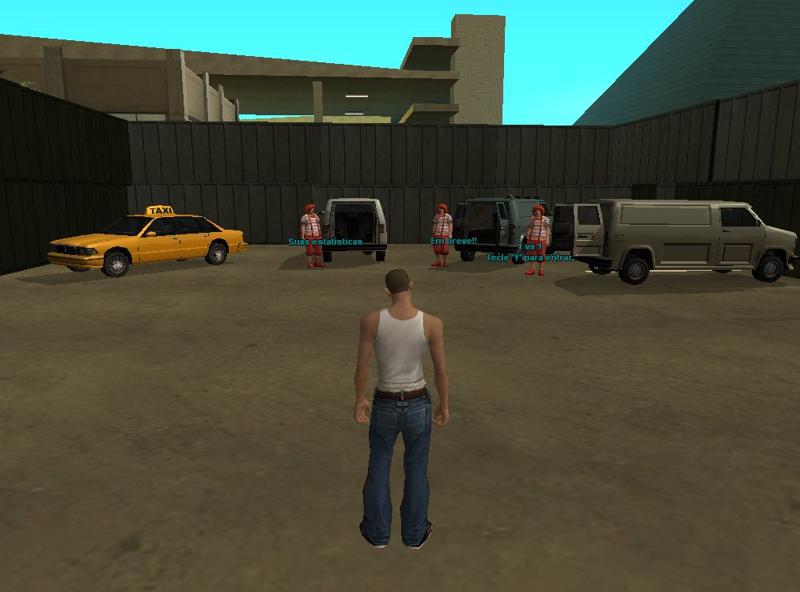

## :alien: Resumo
Este filtro de regras foi criado para os entusiastas do modo mais popular do mundo, conhecido 
como CS ou Country Strike. Com este filtro, você e seu amigo podem aproveitar partidas juntos 
neste modo emocionante.

## :space_invader: Instalação do Filtro no SA:MP
* Copie o arquivo `CountryStrike.amx` para dentro da pasta `filterscripts`;
* Acesse `server.cfg` e adicione `plugins CountryStrike`;
* Pronto, basta executar `samp-server.exe`.

## :japanese_goblin: Eventual Problema
Caso não esteja funcionando corretamente no `filterscript`, tente reiniciar o servidor e adicionar 
o arquivo `CountryStrike.amx` à pasta `gamemodes`, removendo-o do `filterscript`.

> Nota: Se encontrar algum problema, por favor, envie um pull request para que possamos corrigi-lo.

## :clown_face: Imagens

